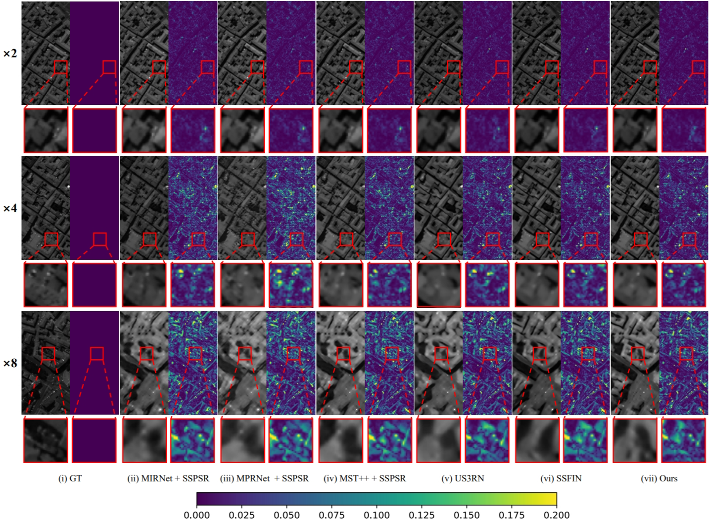

# HLNet
HLNet: Hybrid Learning Network via Implicit Relationship Construction for Spatial-Spectral Super-resolution


## Introduction

Our proposed HLNet consists of three components: dense feature extractor(DFE), hybrid feature learning module(HLM), and hybrid feature reconstruction module(HRM). Firstly, we use the DFE to extract spatial and spectral features from the input image. Secondly, to construct the implicit correlations inherent in the hybrid features, we design the HLM to establish the linkages between the hybrid features while mapping the features to the target spatial dimension. Finally, we invent the HRM for reconstructing the mapped features, and the HRM obtains finer high-resolution hyperspectral images by strengthening the correlation between long-range spectral bands. In addition, according to the properties of hyperspectral images, we propose an interval loss function to constrain the differences between long-range spectral bands of the reconstructed images.


## Get Start

### environment

- python=3.8
- torch=2.1.1

### **Use HLNet training:**

```shell
python main.py --mode=1 --batchSize=8 --save_folder=[your model's save_folder] --upscale_factor=2
```

### **Use HLNet testing:**

```shell
python main.py --mode=0 --nEpochs=[your model's epoch] --save_folder=[your model's save_folder] --upscale_factor=2 --outputpath=[your output_folder] 

(E.g python main.py --mode=0 --nEpochs=43 --save_folder='./TrainedNet/' --upscale_factor=2 --outputpath='./Output/')
```


## Result
<center>
    
    <br>
    <div style="color:orange; border-bottom: 1px solid #d9d9d9;
         display: inline-block; color: #999; padding: 2px;">Qualitative results on the PAVIA CENTRE dataset at band 51. The left side is the image of band 51 and the right side is the corresponding error map.</div>
</center>

